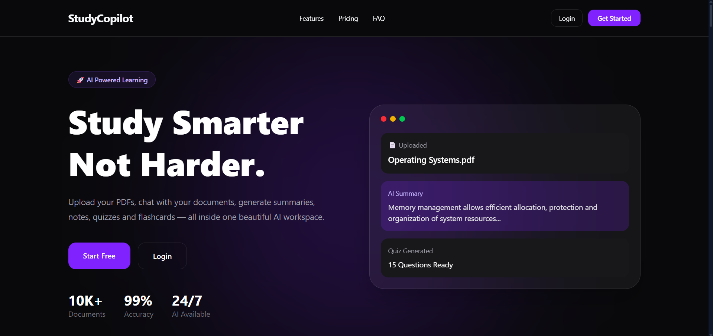
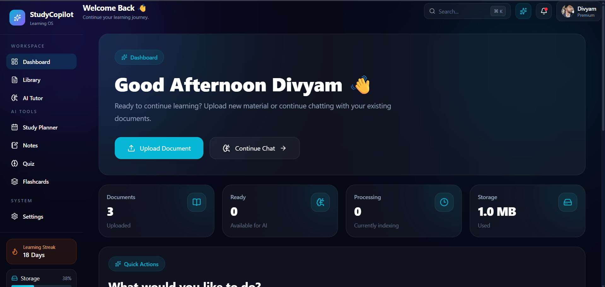
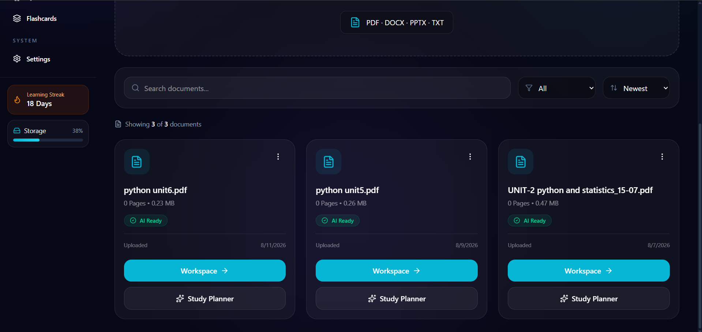
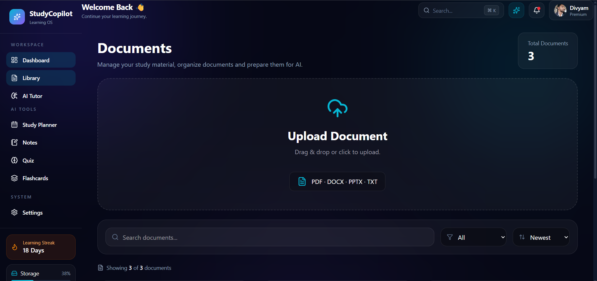
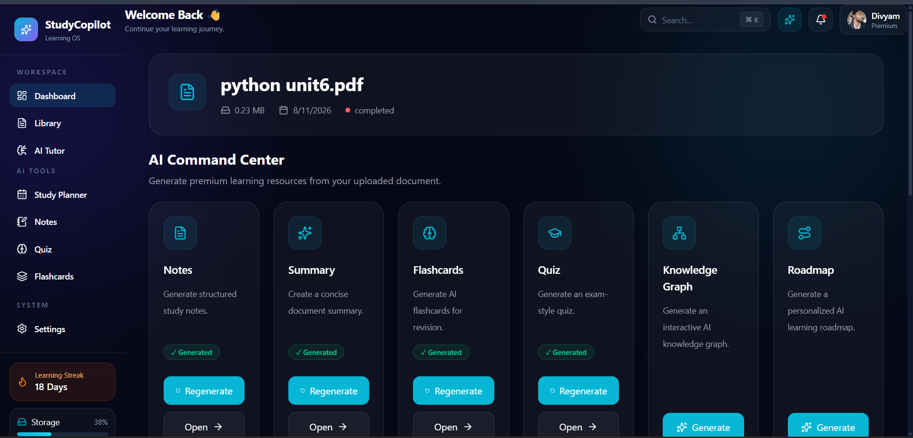

# 🚀 StudyCopilot

<div align="center">

## AI-Powered Learning Assistant

StudyCopilot is an intelligent learning workspace that transforms your study material into interactive learning experiences using Artificial Intelligence.

Upload documents, chat with your PDFs, generate AI notes, summaries, quizzes, flashcards and personalized study plans — all in one powerful platform.

<br/>


<br/>

🌐 **Live Demo**

https://studycopilot.me

<br/>

[GitHub](https://github.com/divyamtiwari99/StudyCopilot)
•
[LinkedIn](https://www.linkedin.com/in/divyam-tiwari-b14171329/)

</div>


---

# ✨ Features

## 📄 AI Document Chat

- Chat with uploaded documents
- Get contextual AI answers
- Understand complex topics easily


## 🧠 Smart Notes Generation

- Generate structured notes automatically
- Extract important concepts
- Convert long documents into readable notes


## 📝 AI Summaries

- Create concise summaries from documents
- Save time while revising


## 🎯 AI Quiz Generator

- Generate exam-style questions
- Practice with AI-generated quizzes


## 🃏 Flashcards

- Create smart revision flashcards
- Improve memory retention


## 📊 Knowledge Graph

- Visualize connections between concepts
- Understand relationships between topics


## 📅 AI Study Planner

- Generate personalized study schedules
- Track learning progress


---

# 🏗️ Tech Stack


## Frontend

- React
- TypeScript
- Tailwind CSS
- Vite


## Backend

- Node.js
- Express.js


## Database

- MongoDB


## Artificial Intelligence

- Google Gemini AI
- RAG (Retrieval Augmented Generation)


---

# 🖥️ Screenshots


## 🏠 Landing Page




## 📊 Dashboard




## 🤖 AI Command Center




## 📚 Document Library




## 🧠 AI Learning Tools




---

# 🌐 Deployment


### Frontend

Vercel

https://studycopilot.me


### Backend

Railway


---

# ⚙️ Local Development


## Clone Repository

```bash
git clone https://github.com/divyamtiwari99/StudyCopilot.git
